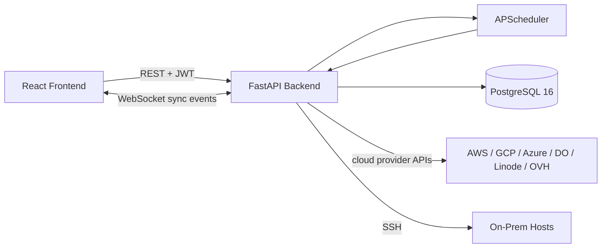

<div align="center">

# ServerInventory

### Self-hosted multi-cloud server inventory and infrastructure operations console

Track servers, databases, Kubernetes clusters, block storage, and DNS records across AWS, GCP, Azure, DigitalOcean, Linode, OVH, and on-premise hosts — from one dashboard, with no vendor lock-in.

[](https://github.com/rushikeshsakharleofficial/server-inventory/blob/main/LICENSE)
[](https://github.com/rushikeshsakharleofficial/server-inventory/stargazers)
[](https://github.com/rushikeshsakharleofficial/server-inventory/actions/workflows/codeql.yml)
[](https://github.com/rushikeshsakharleofficial/server-inventory/actions/workflows/sonar.yml)
[](https://github.com/rushikeshsakharleofficial/server-inventory/issues)

</div>

<p align="center">
  <a href="#features">Features</a> ·
  <a href="#quick-start">Quick Start</a> ·
  <a href="#security">Security</a> ·
  <a href="#contributing">Contributing</a>
</p>

---

## Table of Contents

- [Why ServerInventory](#why-serverinventory)
- [Features](#features)
- [Stack](#stack)
- [Quick Start](#quick-start)
- [First-Run Setup](#first-run-setup)
- [Environment Variables](#environment-variables)
- [Cloud Provider Setup](#cloud-provider-setup)
- [Public API & MCP Server](#public-api--mcp-server)
- [Development](#development)
- [Testing](#testing)
- [Architecture](#architecture)
- [Credential Security](#credential-security)
- [Contributing](#contributing)
- [Security](#security)
- [License](#license)

---

## Why ServerInventory

Most cloud asset inventory tools are paid SaaS products that require sending your credentials and topology to a third party. ServerInventory runs entirely on infrastructure you control:

- **Self-hosted** — credentials and server data never leave your own PostgreSQL instance
- **Multi-cloud from day one** — AWS, GCP, Azure, DigitalOcean, Linode, OVH, plus manually-registered on-prem hosts
- **No agent required** — cloud resources sync via provider APIs; on-prem hosts are discovered and enriched over SSH
- **RBAC built in** — per-user and per-group permissions across every feature, JWT auth, optional TOTP MFA
- **Free and open source** — MIT licensed, fork it, self-host it, modify it

---

## Features

### Multi-Cloud Inventory

- **Servers** — AWS EC2, GCP Compute Engine, Azure VMs, DigitalOcean Droplets, Linode instances, OVH bare metal/VPS/Public Cloud, Contabo VPS, plus manually-registered on-prem hosts
- **Managed Databases** — AWS RDS, GCP Cloud SQL, Azure Database, DigitalOcean Managed DBs, Linode Database Clusters
- **Kubernetes Clusters** — AWS EKS, GCP GKE, Azure AKS, DigitalOcean DOKS, Linode LKE
- **Block Storage** — AWS EBS, Azure Managed Disks, GCP Persistent Disks, DigitalOcean Volumes, Linode Volumes
- **DNS / Domain Inventory** — Cloudflare DNS record sync plus generic DNS resolution, kept separate from cloud provider credentials

### On-Prem Network Discovery

Scan an IPv4 CIDR range over SSH, authenticate with a saved credential, and register live hosts as inventory — deduplicating multi-homed servers into a single record via a priority-ordered identity chain (machine-id, DMI product UUID, SSH host key fingerprint, hostname+MAC).

### Resource Topology Map

Per-server network topology viewer showing connected cloud resources (VPCs, security groups, NICs, firewalls, load balancers) with click-to-navigate deep links.

### IAM / Access Control

- Per-user and per-group permissions across every feature area, with a live-computed super-admin bypass
- JWT auth with 90-day remember-me tokens, TOTP-based MFA
- First-run `/setup` wizard creates the initial administrator — no hardcoded default credentials

### Operational Tooling

- **Live sync via WebSocket** — real-time batch progress, cancellable mid-run
- **Cron scheduler** — APScheduler-backed jobs with a calendar+time picker or raw cron expression, run-now/disable/delete
- **Event log** — structured audit trail across settings, credentials, sync, and discovery
- **Custom branding** — upload a logo and favicon (PNG/JPEG/WEBP/animated GIF), served publicly so the login page picks it up before auth
- **Smart tables** — adaptive rows-per-page based on viewport height, consistent pagination across every list page

---

## Stack

| Layer | Technology |
|:------|:-----------|
| Backend | FastAPI, SQLAlchemy 2.x, PostgreSQL 16 |
| Auth | JWT (python-jose), bcrypt/passlib, TOTP MFA (pyotp) |
| Scheduling | APScheduler, croniter |
| SSH | paramiko |
| Rate limiting | slowapi |
| WebSockets | FastAPI native + asyncio broadcast |
| Frontend | React 19 + TypeScript |
| Routing / data | TanStack Start, TanStack Router, TanStack Query |
| Styling | Tailwind CSS 4 (CSS-first config) |
| Charts | Recharts |
| Date picker | react-day-picker |
| Icons | Lucide React |
| Package manager | Bun (`bun.lock`) |
| Container | Docker Compose (postgres + backend + frontend) |

---

## Quick Start

### Docker — build from source (recommended)

Requires Docker Engine 24+ and Compose v2 (`docker compose`, not the standalone `docker-compose`).

1. Clone the repo and enter it:
   ```bash
   git clone https://github.com/rushikeshsakharleofficial/server-inventory.git
   cd server-inventory
   ```
2. Create `.env` from the example and fill in the required secrets:
   ```bash
   cp backend/.env.example .env
   ```
   Edit `.env` and set at minimum `POSTGRES_PASSWORD`, `SECRET_KEY`, `CREDENTIAL_ENCRYPTION_KEY`, and `API_KEY_PEPPER` (see [Environment Variables](#environment-variables) for how to generate each).
3. Build and start all three services (postgres, backend, frontend):
   ```bash
   docker compose up -d --build
   ```
4. Confirm all three are healthy:
   ```bash
   docker compose ps
   ```
5. Open http://localhost:3001 — it redirects to `/setup` since no admin exists yet. See [First-Run Setup](#first-run-setup).

| URL | Purpose |
|:----|:--------|
| http://localhost:3001 | Frontend dashboard |
| http://localhost:8001/docs | Backend API (Swagger UI) |

> **Security:** Set a strong, unique `SECRET_KEY`, `CREDENTIAL_ENCRYPTION_KEY`, and `API_KEY_PEPPER` before any production or internet-facing deployment. The backend refuses to start in production with a weak or placeholder `SECRET_KEY`.

To stop: `docker compose down` (add `-v` to also drop the Postgres volume — this deletes all data).

### Docker — prebuilt images

Skips the local build; pulls `ghcr.io/rushikeshsakharleofficial/server-inventory-backend` and `-frontend` (published on every push to `main`, tagged `latest` and by commit SHA).

1. Clone the repo (still needed for `docker-compose.yml` and `postgres`'s config) and enter it:
   ```bash
   git clone https://github.com/rushikeshsakharleofficial/server-inventory.git
   cd server-inventory
   ```
2. Create `.env` the same way as above:
   ```bash
   cp backend/.env.example .env   # edit POSTGRES_PASSWORD, SECRET_KEY, CREDENTIAL_ENCRYPTION_KEY, API_KEY_PEPPER
   ```
3. Create `docker-compose.override.yml` next to `docker-compose.yml` to swap both app services to the published images — **do not edit `docker-compose.yml` directly**, since `backend`'s `volumes: [./backend:/app]` bind-mount must not carry over: it overlays the image's own `/app` with your local checkout, which is only correct when building locally.
   ```yaml
   services:
     backend:
       image: ghcr.io/rushikeshsakharleofficial/server-inventory-backend:latest
       build: !reset null
       volumes: !reset []
     frontend:
       image: ghcr.io/rushikeshsakharleofficial/server-inventory-frontend:latest
       build: !reset null
   ```
   (The published frontend image already has `VITE_API_URL` baked in as empty/host-derived, so no build `args:` are needed.)
4. Pull and start:
   ```bash
   docker compose pull
   docker compose up -d
   ```
5. Same as above: http://localhost:3001 redirects to `/setup` on first load.

### Local (no Docker)

```bash
# Terminal 1 — Backend
cd backend
pip install -r requirements.txt
cp .env.example .env   # edit DATABASE_URL, SECRET_KEY, CREDENTIAL_ENCRYPTION_KEY, API_KEY_PEPPER
uvicorn app.main:app --reload --port 8000
```

```bash
# Terminal 2 — Frontend
cd frontend
bun install
bun run dev
```

---

## First-Run Setup

This app has no default username/password. The first time it starts with no admin user in the database:

1. Visiting `/login` automatically redirects to `/setup`.
2. `/setup` lets you create the first administrator account (username, full name, password).
3. Once that account exists, `/setup` becomes permanently unreachable — both the UI (redirects to `/login`) and the API (`POST /api/setup/bootstrap` returns `409` if an admin already exists).

---

## Environment Variables

Docker Compose reads `.env` from the project root. Create it from the backend's example:

```bash
cp backend/.env.example .env
```

| Variable | Required | Description |
|:---------|:--------:|:------------|
| `POSTGRES_PASSWORD` | Yes | PostgreSQL password — read at container boot, before the app can start |
| `DATABASE_URL` | Yes (local/no-Docker only) | Full PostgreSQL connection string |
| `SECRET_KEY` | **Yes in prod** | JWT signing secret — generate with `python -c "import secrets; print(secrets.token_urlsafe(32))"` |
| `CREDENTIAL_ENCRYPTION_KEY` | **Yes in prod** | Fernet key encrypting stored provider/SSH credentials at rest — generate with `python -c "from cryptography.fernet import Fernet; print(Fernet.generate_key().decode())"` |
| `API_KEY_PEPPER` | **Yes to use the Public API** | HMAC key for hashing public API tokens — generate with `python -c "import secrets; print(secrets.token_urlsafe(32))"`; without it, creating/rotating an API key fails |
| `ADMIN_USERNAME` / `ADMIN_PASSWORD` | No | Optional non-interactive admin seed — the normal path is the `/setup` wizard above |
| `ALLOWED_ORIGINS` | No | Comma-separated CORS origins for the frontend |
| `VITE_API_URL` | No | Leave empty in most deployments — the frontend derives the backend host/port from the page it's served from |

> `SECRET_KEY` and `CREDENTIAL_ENCRYPTION_KEY` cannot be set from within the app itself — both are read once at process startup, before any HTTP route (including `/setup`) can be served.

---

## Cloud Provider Setup

Add credentials via **Cloud Providers → Add Credential** in the UI. Fields vary per provider; see the in-app form for the exact set required (access keys, service account JSON, subscription IDs, API tokens, etc.) for AWS, GCP, Azure, DigitalOcean, Linode, OVH Cloud, and Contabo. DNS providers (currently Cloudflare) are configured separately under **DNS Providers**, keeping DNS credentials isolated from compute-sync credentials.

---

## Public API & MCP Server

A read/write REST API under `/public/v1`, separate from the browser-session JWT auth, for scripting against inventory data or wiring it into CI.

- **API keys** — create, rotate, and revoke under **Access → API Keys**. A key is stamped with its creator's current permissions at creation time; every request re-checks `key scopes ∩ owner's live IAM permissions`, so revoking a permission from the owner immediately narrows every key they hold, without editing the key itself.
- **Auth** — `Authorization: Bearer si_live_...`, no JWT involved.
- **Coverage** — servers, IP inventory, databases, kubernetes, block storage, discovery jobs/run-once, sync trigger, per-server resource map.
- **MCP server** — a standalone MCP server (`mcp-server/`, stdio transport) wraps the public API as tools, so an MCP-aware assistant can list servers, trigger a sync, or run discovery directly. Packaged as a Claude Code plugin (`plugins/server-inventory-mcp/`) with a bundled setup skill and a `/server-inventory-mcp:server-inventory-setup` guided-setup command — see `mcp-server/README.md` for standalone use.

---

## Development

### Project Structure

```
server-inventory/
├── backend/
│   ├── app/
│   │   ├── providers/           # Cloud provider sync implementations
│   │   ├── routers/             # FastAPI routers — servers, sync, databases,
│   │   │                        #   kubernetes, discovery, domains, iam, branding, ...
│   │   ├── auth.py              # JWT auth, password hashing, role guards
│   │   ├── database.py          # SQLAlchemy engine + session factory
│   │   ├── discovery_service.py # On-prem SSH discovery + identity resolution
│   │   ├── main.py              # FastAPI app, lifespan, WebSocket endpoint
│   │   ├── models.py            # SQLAlchemy ORM models
│   │   ├── permissions.py       # IAM feature/action catalog
│   │   ├── schemas.py           # Pydantic request/response schemas
│   │   └── ssh_utils.py         # SSH connection + host fact collection
│   ├── tests/                   # pytest suite
│   └── Dockerfile
├── frontend/
│   ├── src/
│   │   ├── components/
│   │   │   ├── app-shell.tsx        # Sidebar + header layout
│   │   │   ├── SmartTable.tsx       # Adaptive-height paginated table
│   │   │   ├── SmartPagination.tsx
│   │   │   └── advanced-filter.tsx  # Shared search + filter bar
│   │   ├── hooks/
│   │   │   └── useAdaptivePageSize.ts
│   │   ├── lib/
│   │   │   ├── api.ts            # Fetch client, protocol-aware API base
│   │   │   ├── auth.ts
│   │   │   ├── branding.ts       # Logo/favicon fetch hooks
│   │   │   └── ws.ts             # WebSocket client + message routing
│   │   └── routes/               # TanStack Router file-based routes
│   │       ├── _app.servers.tsx
│   │       ├── _app.discovery.tsx
│   │       ├── _app.domains.tsx
│   │       ├── _app.policies.tsx
│   │       └── ...
│   └── Dockerfile
├── docker-compose.yml
└── LICENSE
```

### Frontend Commands

Run from `frontend/`:

| Command | Purpose |
|:--------|:--------|
| `bun run dev` | Start the Vite dev server |
| `bun run build` | TypeScript check + production build |
| `bun run preview` | Serve the production build locally |
| `bun run lint` | ESLint |
| `bun run format` | Prettier |

### Backend Commands

Run from `backend/`:

```bash
uvicorn app.main:app --reload --port 8000
```

---

## Testing

Backend tests are pytest-based, covering auth policy, credential encryption/masking, TOTP, schemas, and the on-prem discovery identity-resolution logic:

```bash
cd backend
pytest
```

| Suite | Covers |
|:------|:-------|
| `test_auth_policy.py` | Role/permission enforcement |
| `test_credential_masking.py` | Credentials never leak in API responses |
| `test_crypto.py` | Fernet encryption/decryption of stored config |
| `test_discovery_service.py` | CIDR validation, identity-signal priority, host dedup |
| `test_schemas.py` | Pydantic schema validation |
| `test_totp_encryption.py` | MFA secret storage |

---

## Architecture



### Key Data Models

| Model | Purpose |
|:------|:--------|
| `Server` | Multi-cloud + on-prem VM inventory |
| `ServerIpAddress` | Per-interface IP addresses, deduped across discovery + legacy sync paths |
| `DatabaseInstance` / `KubernetesCluster` / `BlockStorage` | Managed cloud resources |
| `Credential` | Provider credentials (encrypted config JSON) |
| `SSHCredential` | SSH key/password credentials for on-prem hosts |
| `DiscoveryNetwork` / `DiscoveryJob` / `DiscoveryResult` | On-prem CIDR scan definitions and run history |
| `User` / `Group` | Auth users and groups with per-feature/action permissions |
| `CronJob` | Scheduled sync jobs |
| `AppSetting` | Key-value app settings (SSH port, sync timeout, branding assets) |

---

## Credential Security

- Provider credential secrets (passwords, API keys, tokens) are encrypted at rest with a Fernet key (`CREDENTIAL_ENCRYPTION_KEY`) separate from the database itself — a DB dump alone does not expose them
- Credential values are masked by default in the UI; reveal/copy actions are permission-gated
- Uploaded branding assets accept raster images and GIF only — SVG is rejected to avoid stored XSS via inline script execution
- Enable MFA on admin accounts via **Settings → Two-factor authentication**
- Production deployments must terminate TLS in front of the app — do not expose the backend's plain HTTP port directly to the internet
- Never commit `.env` files or real credentials

---

## Contributing

ServerInventory is open source and welcomes contributions — from small fixes to new cloud providers.

**How to contribute:**

1. **Fork** the repository
2. **Create a branch**: `git checkout -b feat/your-feature-name`
3. **Set up** using Docker or the local path above
4. **Build check**: `cd frontend && bun run build`
5. **Open a PR** against `main` with a clear description of what changed and why

[Open an issue](https://github.com/rushikeshsakharleofficial/server-inventory/issues) first if you want feedback before writing code.

<a href="https://github.com/rushikeshsakharleofficial/server-inventory/graphs/contributors">
  
</a>

---

## Security

To report a security vulnerability, use [GitHub Security Advisories](https://github.com/rushikeshsakharleofficial/server-inventory/security/advisories/new) rather than opening a public issue.

**Production hardening checklist:**

- Set a strong, unique `SECRET_KEY` and `CREDENTIAL_ENCRYPTION_KEY`
- Complete `/setup` immediately after first deploy — the instance has no functioning login until an admin exists
- Enable MFA on the admin account
- Place the app behind a reverse proxy with TLS — do not expose the backend's plain HTTP port directly
- Restrict PostgreSQL access to the backend container/network only

---

## License

MIT — free to use, modify, distribute, and build on, including for commercial purposes. See [LICENSE](LICENSE).

---

<div align="center">

[⭐ Star on GitHub](https://github.com/rushikeshsakharleofficial/server-inventory) · [🐛 Report a Bug](https://github.com/rushikeshsakharleofficial/server-inventory/issues/new) · [🤝 Contribute](https://github.com/rushikeshsakharleofficial/server-inventory/fork)

[](https://star-history.com/#rushikeshsakharleofficial/server-inventory&Date)

</div>
